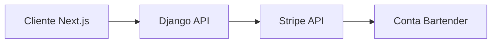
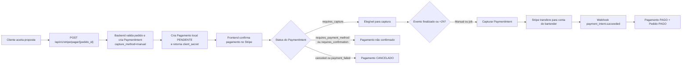

# Sistema de Pagamentos - ProBar

> Sistema de intermediação de pagamentos entre clientes e bartenders utilizando Stripe Connect, com retenção e liberação controlada de valores.


---

## Sumário

* [Visão Geral](#visão-geral)
* [Objetivo e Escopo](#objetivo-e-escopo)
* [Arquitetura e Fluxo](#arquitetura-e-fluxo)
* [Stack e Dependências](#stack-e-dependências)
* [Fluxo de Pagamento](#fluxo-de-pagamento)
* [Segurança e Controle](#segurança-e-controle)
* [Variáveis de Ambiente](#variáveis-de-ambiente)
* [Endpoints](#endpoints)
* [Observações Importantes](#observações-importantes)

---

## Visão Geral

O sistema de pagamentos do ProBar permite que clientes contratem bartenders e realizem pagamentos de forma segura.

A plataforma atua como intermediadora:

* O cliente paga pelo serviço
* O valor fica retido na Stripe
* O pagamento é liberado ao bartender após a conclusão do evento

---

## Objetivo e Escopo

### ✔ Este módulo cobre:

* Integração com Stripe Connect
* Onboarding de bartenders
* Criação e retenção de pagamentos
* Liberação automática ou manual de valores
* Sincronização via webhooks

### ❌ Fora do escopo:

* Interface de pagamento (responsabilidade do frontend)
* Gestão financeira externa
* Relatórios contábeis

---

## Arquitetura e Fluxo



### Resumo:

* Frontend inicia pagamento
* Backend valida e cria PaymentIntent
* Stripe processa e retém valor
* Backend controla liberação

---

## Stack e Dependências

### Core

* Backend: Django + Django REST Framework
* Frontend: Next.js
* Pagamentos: Stripe (Connect + PaymentIntent)
* Banco: PostgreSQL

### Integrações relevantes

* Stripe Connect — onboarding e repasses
* Stripe Webhooks — sincronização de eventos

---

## Fluxo de Pagamento

### 🔁 Visão Geral



---

### Estados do Pagamento (banco)

* **PENDENTE**: PaymentIntent criado e aguardando confirmacao do cliente
  ou elegivel para captura.
* **PAGO**: captura concluida ou Stripe confirmou sucesso.
* **CANCELADO**: pagamento falhou ou foi cancelado no Stripe.

### Método de pagamento registrado

- `metodo_pagamento`: representa o **gateway** interno (atualmente `STRIPE`).
- `stripe_payment_method_type`: guarda o método real usado na Stripe (ex.: `card`, `pix`, `boleto`).
  Esse valor é preenchido quando o PaymentIntent é consultado (captura, job ou webhook).

---

### 1️⃣ Onboarding do Bartender

```http
POST /api/v1/stripe/onboarding/
```

* Cria link Stripe
* Redireciona usuário
* Stripe coleta dados
* Retorna para frontend

---

### 2️⃣ Criação do Pagamento

```http
POST /api/v1/stripe/pagar/{pedido_id}/
```

Validações:

* Cliente autenticado
* Dono do pedido
* Pedido aceito
* Sem pagamento existente
* Bartender com conta Stripe vinculada
* Onboarding Stripe do bartender completo

Se o evento estiver dentro da janela `STRIPE_MANUAL_CAPTURE_WINDOW_DAYS`, o
backend cria um `PaymentIntent` com captura manual e grava um `Pagamento` local
como `PENDENTE`.

Se o evento ainda estiver distante, o backend cria um `SetupIntent` para salvar
o cartao do cliente (`usage=off_session`) e grava o `Pagamento` local como
`PENDENTE`, sem autorizar o valor naquele momento. O job periodico cria o
`PaymentIntent` com captura manual quando o evento entra na janela segura.

---

### 3️⃣ Confirmação (Frontend)

O backend retorna:

```json
{
  "client_secret": "pi_xxx"
}
```

O frontend confirma com Stripe.

Se o cliente não concluir o pagamento, o `PaymentIntent` permanece em
`requires_payment_method` e o pagamento local continua `PENDENTE`.

---

### 4️⃣ Captura (Liberação)

```http
POST /api/v1/stripe/capturar/{pagamento_id}/
```

Liberação ocorre:

* Manual (cliente)
* Automática (2h após evento)

Antes de capturar, o backend consulta o `PaymentIntent` e só tenta capturar
quando o status estiver em `requires_capture`. Status como
`requires_payment_method` são apenas ignorados (aguardando o cliente).

---

### 5️⃣ Webhooks

```http
POST /api/v1/stripe/webhook/
```

Eventos tratados:

* payment_intent.succeeded
* payment_intent.payment_failed

O webhook marca `Pagamento` como `PAGO` e o `Pedido` como `PAGO` quando o
Stripe confirma o sucesso. Em falhas, o pagamento é marcado como `CANCELADO`.

---

## Segurança e Controle

O sistema implementa:

* Validação de permissões
* Idempotência (evita duplicação)
* Transações com lock no banco
* Webhook com assinatura verificada
* Controle de captura manual

---

## Variáveis de Ambiente

| Variável               | Descrição                | Obrigatória |
| ---------------------- | ------------------------ | ----------- |
| STRIPE_SECRET_KEY      | Chave privada Stripe     | ✅           |
| STRIPE_PUBLISHABLE_KEY | Chave pública (frontend) | ✅           |
| STRIPE_WEBHOOK_SECRET  | Validação webhook        | ✅           |

---

Observacao: `STRIPE_MANUAL_CAPTURE_WINDOW_DAYS` controla a janela em que o
backend pode autorizar o cartao com captura manual. O padrao no codigo e 5 dias.

## Endpoints

| Método | Rota                  | Descrição              |
| ------ | --------------------- | ---------------------- |
| POST   | /stripe/onboarding    | Gerar link onboarding  |
| GET    | /stripe/status        | Verificar onboarding   |
| POST   | /stripe/pagar/{id}    | Criar pagamento        |
| POST   | /stripe/setup-confirmado/{id} | Sincronizar cartao salvo |
| POST   | /stripe/capturar/{id} | Capturar pagamento     |
| POST   | /stripe/webhook       | Receber eventos Stripe |

---

## Observações Importantes

* Eventos distantes salvam o cartao via `SetupIntent`; a autorizacao do valor
  acontece apenas quando o evento entra em `STRIPE_MANUAL_CAPTURE_WINDOW_DAYS`

* O pagamento utiliza **captura manual (retenção)**
* O backend controla quando o dinheiro é liberado
* O frontend apenas confirma o pagamento
* Stripe é responsável pelo processamento financeiro
* A captura automática só ocorre quando o `PaymentIntent` está em
  `requires_capture`

---

## Agendamento da captura automática

O backend executa periodicamente o job `processar_pagamentos_pendentes` para
verificar pagamentos `PENDENTE` e liberar apenas os que já passaram da regra
de 2h após o fim do evento.

O job roda via management command e deve ser agendado pela plataforma de deploy
(por exemplo, Render Cron Job):

```
cd backend/probar_api && python manage.py processar_pagamentos_pendentes
```

Agendamento sugerido:

```
*/5 * * * *
```

Os logs ficam em `backend/probar_api/logs/pagamentos_cron.log`.

---

## Resultado

O sistema garante:

* Segurança nas transações
* Controle total do fluxo financeiro
* Proteção contra fraude e duplicidade
* Base pronta para produção

---

## Licença

Uso interno — ProBar
